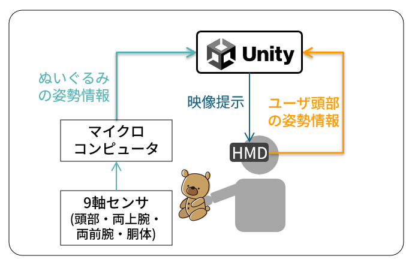
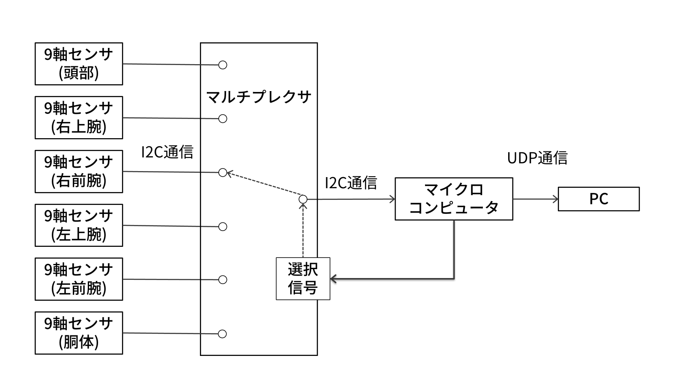
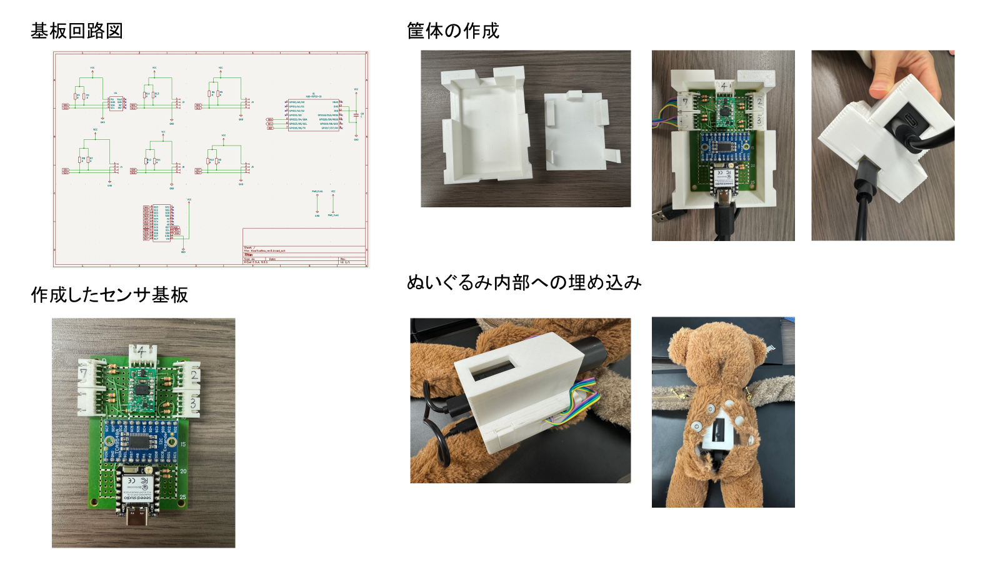
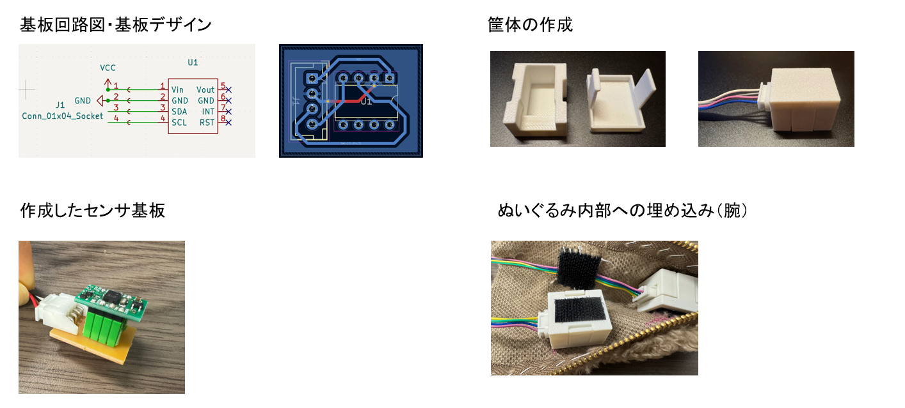

# VRぬいぐるみアバター操作システム

ぬいぐるみの身体動作を用いてVR空間のアバターを操作するシステムです。ユーザーがぬいぐるみを「触る」「動かす」ことで、アバターに直感的な身体表現を与えます。全身ボディトラッキングのような装着負担を抑えながら、手軽に自然な操作を実現することを目指しています。

## 概要

### 背景

VR空間におけるアバター操作は普及が進む一方で、従来の手法には次のような課題がありました。

- 全身ボディトラッキングでは、ユーザー自身の身体動作をそのまま反映できる一方で、装着や長時間の運用に伴う身体的負担が大きい
- ボタン式コントローラでは、比較的手軽に操作できる一方で、入力とアバターの動作が一致せず、身体としての直感的な操作が難しい

### 提案

本システムでは、これらの課題を同時に解決するために「ぬいぐるみ」をインターフェースとして採用しました。

ぬいぐるみを用いることで、ユーザーは自然な身体動作をそのままアバター操作に転写できます。これにより、最小限の身体負荷で思い通りの動作を実現しつつ、ユーザーの心理的ハードルを下げることができます。特に、ぬいぐるみを媒介にすることで、キャラクターになりきって大胆で愛らしい動作を自然に引き出すことが可能になります。

## システム構成



### 主要な構成

- 9軸センサ（頭部、両上腕、両前腕、胴体）
- マルチプレクサ（I2C通信）
- XIAO ESP32-C6 マイコン
- Unity ベースのVRアプリケーション
- Meta Quest 3 による視覚提示
- 3Dプリントした筐体とぬいぐるみ内部への搭載

### 通信構成

```
9軸センサ × 7
   ↓ I2C
マルチプレクサ
   ↓ I2C
XIAO ESP32-C6 (マイコン)
   ↓ UDP
PC (Unity)
   ↓
Meta Quest 3 HMD
```



- センサ群は I2C で集約されます
- マイコンがセンサデータを PC に送信します
- PC 上の Unity でアバターの姿勢と動作を更新します
- HMD によってユーザーは VR 空間でアバターを視覚的に確認します





## 使用技術

- Unity（VRアプリケーション開発、アバター制御）
- Arduino IDE / XIAO ESP32-C6（センサデータの取得、PCへのデータ送信）
- KiCad（基板作成）
- Meta Quest 3（ユーザーへの視覚提示）
- Fusion360 / Bamboo Studio（筐体のモデリング、3Dプリンター印刷）

## 通信方式

本システムでは、センサデータを PC へ送信するために UDP 通信を採用しています。

- 通信方式: UDP
- 通信対象: マイコンボード → PC
- 役割: 9軸センサの姿勢情報をリアルタイムに送信し、Unityでアバター制御に反映
- 特徴: 低遅延・ワイヤレス・リアルタイム操作に適している

センサデータはI2Cでマルチプレクサ経由で収集され、ESP32-C6側でパケット化されたのち、Unityへ送信されます。

## ハードウェア詳細

### センサ配置

本システムでは7箇所に9軸センサを配置しています。

- 頭部
- 右上腕
- 右前腕
- 左上腕
- 左前腕
- 胴体
- 追加の計測部位（実装に応じて可変）

### 基板と筐体

- KiCad で設計したセンサ基板を使用
- マルチプレクサにより複数のセンサを一括制御
- 3Dプリントで筐体を作成し、ぬいぐるみの内部へ埋め込み
- ぬいぐるみの内部にセンサユニットを埋め込み、見た目と操作性を両立

### 3Dプリントと製作例

- 基板回路図と基板デザインを作成
- 筐体をプリントして内部に組み込み
- ぬいぐるみ内部へセンサー基板と配線を納めて完成

## システムの流れ

1. ぬいぐるみの各部位で姿勢が変化する
2. 9軸センサがその変化を計測する
3. マルチプレクサを介してマイコンへ送信される
4. XIAO ESP32-C6 が UDP で Unity 側へデータ送信する
5. Unity が受信した姿勢情報をアバターの各部位へ適用する
6. HMD を通じてユーザーは VR 空間で操作結果を確認する

## 実装上のポイント

- センサの取り付け位置は、アバターの自然な動きと操作性を両立するように設計
- ぬいぐるみ内部への埋め込みにより、見た目の違和感を抑制
- アバターの動きは、姿勢角度をそのまま各ボーンへ反映するのではなく、必要に応じて補正や平滑化を行う
- UDP の低遅延性を活かして、VR環境における直感的な操作を優先

## 実装ファイル

このリポジトリには、Unity側の操作スクリプトやシリアル/UDP関連の実装が含まれています。

- Unity アプリケーション: `PuppetManipulation_Software/`
- ハードウェア(基板、Arduino IDE、3Dプリンタデータなど): `PuppetManipulation_Hardware/`
- センサ制御と通信: `Assets/` 配下のスクリプト群
- キャラクター制御: `Assets/Scripts/Puppet/` など

## セットアップ

### 必要な環境

- Unity
- Meta Quest 3
- XIAO ESP32-C6
- Arduino IDE
- KiCad（基板改造時）
- 3Dプリンタ（筐体作成時）

### 基本的な手順

1. このリポジトリをクローンする
2. Unity プロジェクトを開く
3. マイコンにセンサ制御プログラムを書き込む
4. ぬいぐるみにセンサユニットを取り付ける
5. Unity 実行時に UDP 接続を確認する
6. VR 空間でアバターが動くことを確認する
